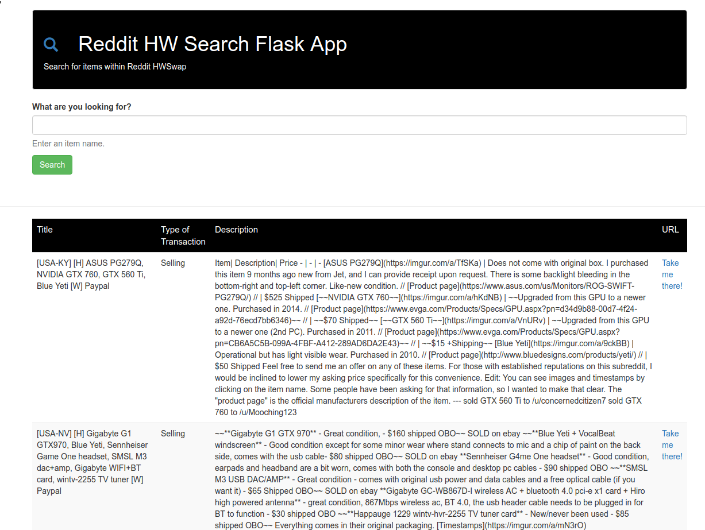

# Flask Reddit HardwareSwap Search #

Small flask app to pull the latest data from r/hardwareswap, it currently only pulls a week so you can find fresh trades.

## Requirements ##

- praw
- flask
- gunicorn (For heroku mostly)

You must create an app to obtain a client and secret keys.
follow - https://praw.readthedocs.io/en/latest/getting_started/authentication.html

## Screenshots ##

## Try it with Heroku ##

[Flask App on Heroku](https://polar-garden-47020.herokuapp.com/)

